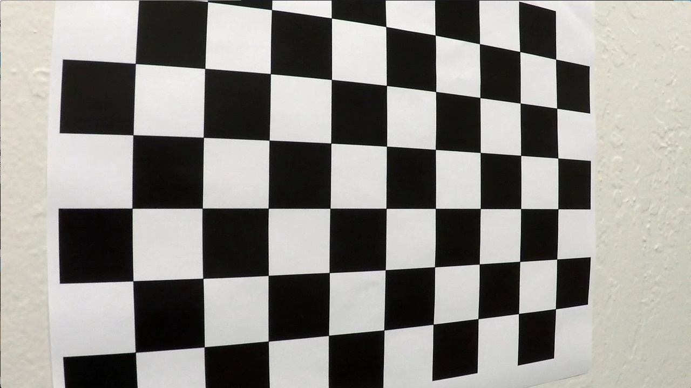
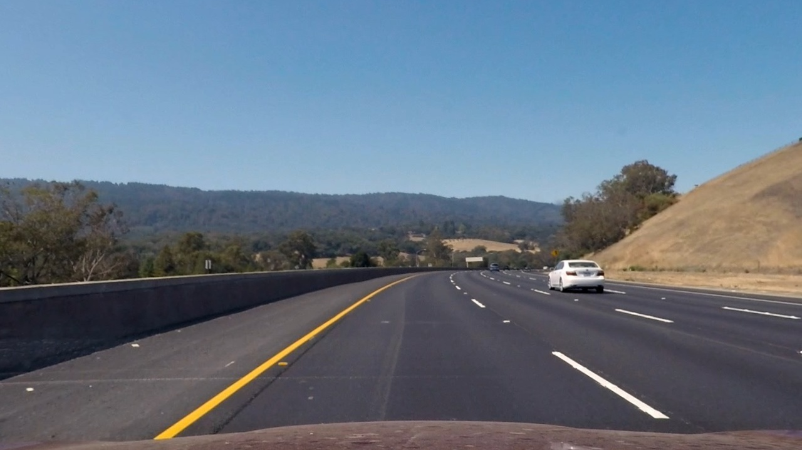
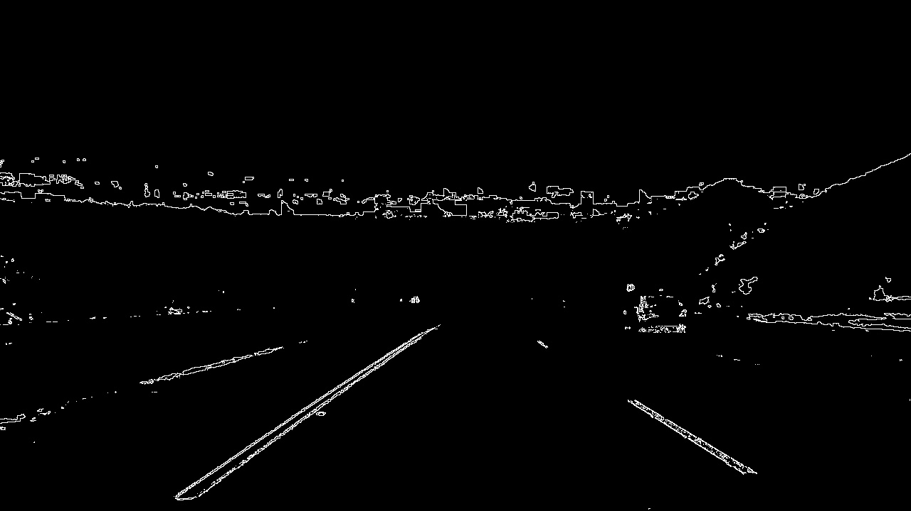
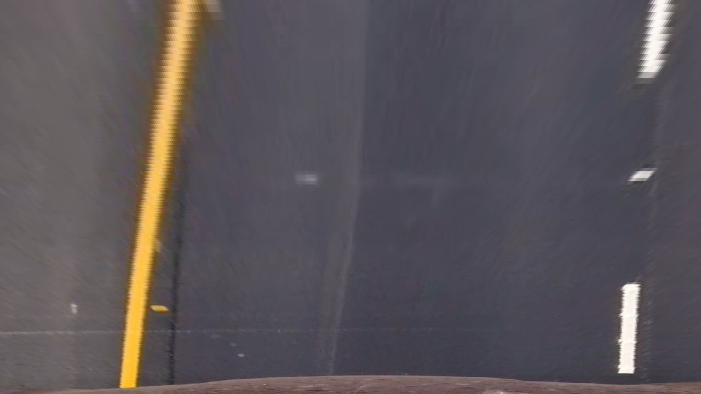
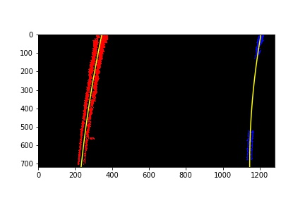
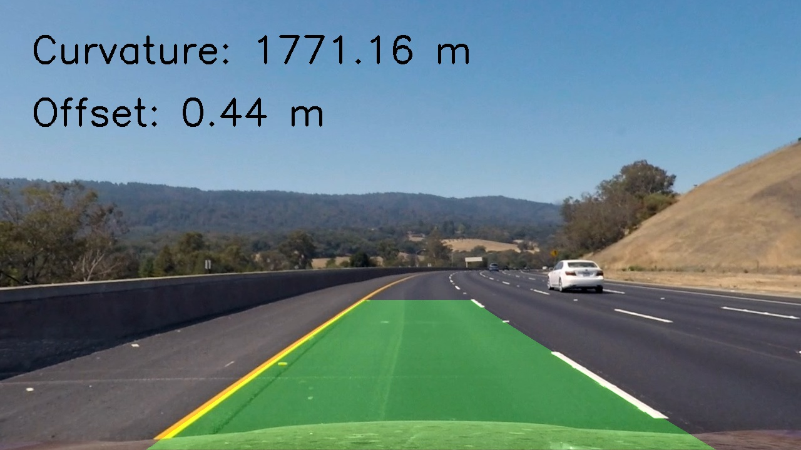

## Writeup - Advanced Lane Lines

---

**Advanced Lane Finding Project**

The goals / steps of this project are the following:

* Compute the camera calibration matrix and distortion coefficients given a set of chessboard images.
* Apply a distortion correction to raw images.
* Use color transforms, gradients, etc., to create a thresholded binary image.
* Apply a perspective transform to rectify binary image ("birds-eye view").
* Detect lane pixels and fit to find the lane boundary.
* Determine the curvature of the lane and vehicle position with respect to center.
* Warp the detected lane boundaries back onto the original image.
* Output visual display of the lane boundaries and numerical estimation of lane curvature and vehicle position.

[//]: # (Image References)

[image1]: ./examples/undistort_output.png "Undistorted"
[image2]: ./test_images/test1.jpg "Road Transformed"
[image3]: ./examples/binary_combo_example.jpg "Binary Example"
[image4]: ./examples/warped_straight_lines.jpg "Warp Example"
[image5]: ./examples/color_fit_lines.jpg "Fit Visual"
[image6]: ./examples/example_output.jpg "Output"
[video1]: ./project_video.mp4 "Video"

## [Rubric](https://review.udacity.com/#!/rubrics/571/view) Points

### Here I will consider the rubric points individually and describe how I addressed each point in my implementation.  

---

### Writeup / README

#### 1. Provide a Writeup / README that includes all the rubric points and how you addressed each one.  You can submit your writeup as markdown or pdf.  [Here](https://github.com/udacity/CarND-Advanced-Lane-Lines/blob/master/writeup_template.md) is a template writeup for this project you can use as a guide and a starting point.  

You're reading it!

### Camera Calibration

#### 1. Briefly state how you computed the camera matrix and distortion coefficients. Provide an example of a distortion corrected calibration image.

The code for this step is contained in the first code cell of the IPython notebook located in "advanced_lane_lines.ipynb" 

I start by preparing "object points", which will be the (x, y, z) coordinates of the chessboard corners in the world. Here I am assuming the chessboard is fixed on the (x, y) plane at z=0, such that the object points are the same for each calibration image.  Thus, `objp` is just a replicated array of coordinates, and `objpoints` will be appended with a copy of it every time I successfully detect all chessboard corners in a test image.  `imgpoints` will be appended with the (x, y) pixel position of each of the corners in the image plane with each successful chessboard detection.  

I then used the output `objpoints` and `imgpoints` to compute the camera calibration and distortion coefficients using the `cv2.calibrateCamera()` function.  I applied this distortion correction to the test image using the `cv2.undistort()` function and obtained this result: 




### Pipeline (single images)

#### 1. Provide an example of a distortion-corrected image.

To demonstrate this step, I will describe how I apply the distortion correction to one of the test images like this one:




#### 2. Describe how (and identify where in your code) you used color transforms, gradients or other methods to create a thresholded binary image.  Provide an example of a binary image result.

I used a combination of color and gradient thresholds to generate a binary image. After testing many options, I ended up using X direction gradient thresholding along with color thresholding on the S channel of the images (the function definition for "threshold_s_x_color" can be found in the fourth cell of "advanced_lane_lines.ipynb" and the output can be viewed in the fifth cell).  Here's an example of my output for this step. 




#### 3. Describe how (and identify where in your code) you performed a perspective transform and provide an example of a transformed image.

My warped image is obtained in cell 6 of "advanced_lane_lines.ipynb" by using the cv2.warpPerspective() function. This function gets the transformation matrix M from another cv2 function, cv2.getPerspectiveTransform. This function takes source (`src`) and destination (`dst`) points as inputs.  I chose the hardcode the source and destination points in the following manner:

```python
offset = 190
src = np.float32([(190, 720), 
	(548, 480), 
	(740, 480), 
	(1130, 720)])
dst = np.float32([(offset, img_shape[1]), 
	(offset, 0), 
	(img_shape[0] - 150, 0), 
	(img_shape[0] - 150, img_shape[1])])
```

I verified that my perspective transform was working as expected by drawing the `src` and `dst` points onto a test image and its warped counterpart to verify that the lines appear parallel in the warped image.





#### 4. Describe how (and identify where in your code) you identified lane-line pixels and fit their positions with a polynomial?

I fit second degree polynomials to the lane lines in cell 8 of "advanced_lane_lines.ipynb" by first creating histograms of pixel intensities on the bottom half of the image. I was able to identify peaks on the left and right side of of the histogram which I would use to reduce the space I needed to search for lane lines in the image. I used 9 "windows" which slid vertically up the image to identify points to which I could fit a polynomial. Each window was 1/9th the image height and searched only within a small range of the x coordinates found using the histogram.

In the video, I used information from previous frames to help with the line fitting. I searched in the general area I spotted lines before to reduce search space. If the new lines I found were not approximately the proper distance apart (>850 pixels) or approximately parallel (variance >1000), I used the previous line fits and started with a fresh window search on the next frame.



#### 5. Describe how (and identify where in your code) you calculated the radius of curvature of the lane and the position of the vehicle with respect to center.

I define calculate_curvature() in cell 11 of "advanced_lane_lines.ipynb". It separately calculates the curvatures of the left and right lane lines and converts them to meters from pixels. In my lane_finder() function, I take the average of the curvature for the left and right lines. For the offset, I calculate the mean value of the x coordinates of my two line fits. This gives me the approximate x coordinate of the lane's center. I then subtract this from the midpoint of the image width to get the offset in pixels. Lastly, I convert these to meters.

#### 6. Provide an example image of your result plotted back down onto the road such that the lane area is identified clearly.

My full pipeline lives within the lane_finder() function in cell 17 of "advanced_lane_lines.ipynb". This fits polynomials to lane lines (either using the previous lines as a guide or from a fresh window search), plots those lines onto the original images and overlays the curvature and offset values in meters. An example of a fully processed image from lane_finder() is below:



---

### Pipeline (video)

#### 1. Provide a link to your final video output.  Your pipeline should perform reasonably well on the entire project video (wobbly lines are ok but no catastrophic failures that would cause the car to drive off the road!).

Here's a [link to my video result](./project_video_output.mp4)

---

### Discussion

#### 1. Briefly discuss any problems / issues you faced in your implementation of this project.  Where will your pipeline likely fail?  What could you do to make it more robust?

Here I'll talk about the approach I took, what techniques I used, what worked and why, where the pipeline might fail and how I might improve it if I were going to pursue this project further.  

Firstly, I had a lot of difficulty with the shadow and changing road colors in the project video. I was able to use the measurements from previous line fits in frames where window search and searching from previous line fits failed to overcome this in the video. In reality, if a shadow stuck around too long my car would continue traveling in the direction of its last lane line detection and probably do something I don't want it to do.

Another issue I realized was that I had set up my pipeline to perform a window search for both the left and right lines if it failed on *either one* of previous left or right lines. This means I was throwing out valuable information for both lines even if my pipeline only had trouble with one. My project works this way, but I would certainly go back through and ensure I was using all of the information at my disposal if I were to work on this longer.

Lastly, I'm aware that if a video stream starts at a difficult place for my pipeline, it will fail from the start. Since I have sanity checks built in, measurements will be thrown out if they don't make sense even if it's the first frame. In the future, I may have to edit my thresholding steps to allow in more pixels and avoid having so many measurements thrown out.
